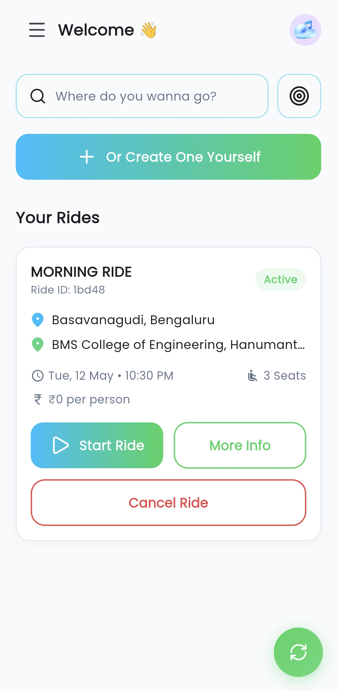
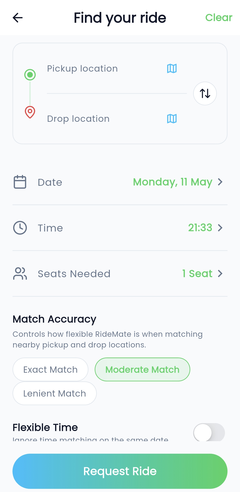
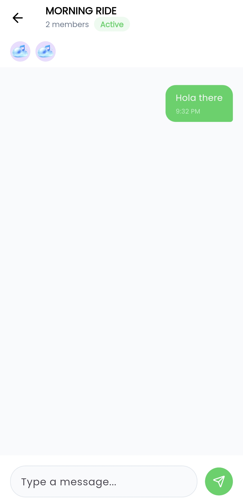
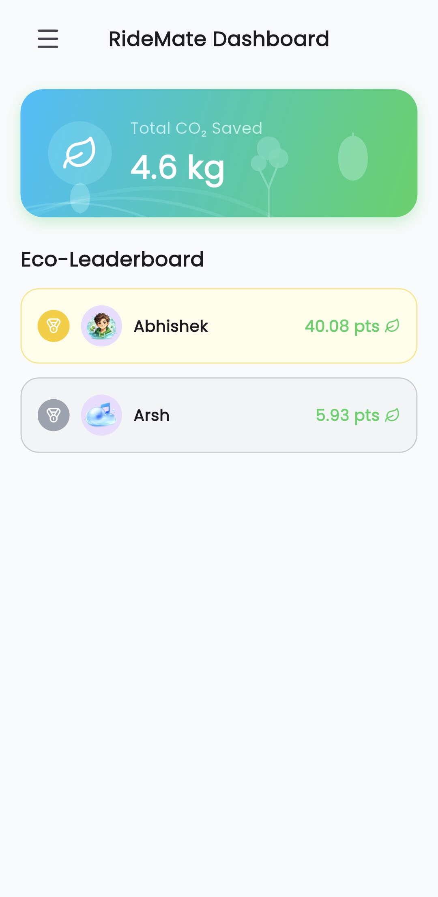
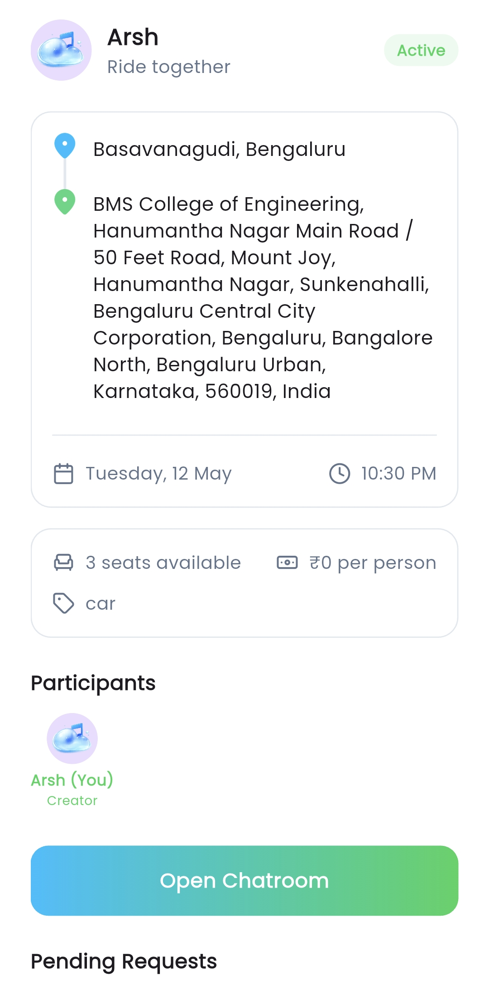

# RideMate - Frontend

RideMate is a college-focused ride-sharing and commute coordination application designed specifically for students to share rides, split costs, and reduce their carbon footprint. 

This repository contains the **Flutter frontend** application. The backend is a separate Node.js service that must be running for this app to function fully.

---

## 📝 Project Overview
This project was built as a part of the Mobile App Development coursework by me as the sole developer at BMSCE. It aims to solve the daily commuting challenges faced by students by providing a trusted network within the college community to share rides.

> [!NOTE]
> This is a student project built with educational purposes in mind. It has scalability limitations and is not intended for large-scale production use without further optimization and security hardening.

---

## ✨ Features
* **Ride Creation & Search**: Create a ride offer or search for available rides based on source, destination, and date.
* **Real-time Ride Matching**: Find students traveling on similar routes.
* **In-App Chat**: Coordinate with your ride partners in real-time.
* **Live Ride Updates**: Get notified when a ride starts, completes, or is cancelled.
* **Eco Score System**: Earn points for sharing rides and track your estimated CO2 savings.
* **Walk Together Mode**: Coordinate with friends to walk to campus together for safety and company.

---

## 🛠️ Tech Stack
* **Framework**: Flutter
* **Language**: Dart
* **Authentication**: Firebase Authentication
* **State Management**: Statefully managed with hooks/notifiers
* **Mapping**: Flutter Map (OpenStreetMap)
* **Real-time Communication**: Socket.IO Client

---

## 📁 Project Structure
Here is a high-level overview of the important directories in the `lib` folder:

```text
lib/
├── core/
│   └── constants.dart      # API endpoints and app constants
├── models/
│   ├── ride.dart           # Ride data model
│   └── user.dart           # User data model
├── screens/
│   ├── home_screen.dart    # Main screen
│   └── login_screen.dart   # Login screen
├── service/
│   ├── auth_service.dart   # API communication
│   └── socket_service.dart # Socket communication
└── widgets/
    └── ride_card.dart      # Reusable components
```

---

## 🚀 Setup Instructions

### Prerequisites
* Flutter SDK (Latest stable version recommended)
* Dart SDK
* Android Studio / VS Code with Flutter extensions
* A running instance of the RideMate Backend

### 1. Clone the Repository
```bash
git clone https://github.com/Arsh1255/RideMate-Frontend.git
cd RideMate-Frontend
```

### 2. Install Dependencies
```bash
flutter pub get
```

---

## 🔥 Firebase Setup
This project uses Firebase Authentication for secure login. You must configure your own Firebase project to run the app.

1. Create a project in the [Firebase Console](https://console.firebase.google.com/).
2. Enable **Email/Password** authentication in the Firebase Auth section.
3. Add an Android/iOS app to your Firebase project.
4. Download the `google-services.json` file and place it in the `android/app/` directory.
5. (Optional) Run `flutterfire configure` to generate the `lib/firebase_options.dart` file automatically.

---

## 🌐 Backend Configuration
The app communicates with a Node.js backend. You must point the Flutter app to your running backend server.

1. Open `lib/core/constants.dart`.
2. Replace `YOUR_BACKEND_URL` with your actual backend IP or domain:

```dart
class AppConstants {
  // Replace with your backend URL here instead of localhost
  static const String baseUrl = "YOUR_BACKEND_URL/api";
  static const String socketUrl = "YOUR_BACKEND_URL";
  
  // ... endpoints
}
```
> [!IMPORTANT]
> Do not use `localhost` if you are testing on a real physical device. Use the IPv4 address of your computer running the backend.

Make sure the backend repository is cloned, configured, and running separately.

---

## ▶️ Running the App
Connect a physical device or start an emulator, then run:

```bash
flutter run
```

---

## 📦 APK Build Command
To generate a release APK for installation on Android devices:

```bash
flutter build apk --release
```
The generated APK will be located at `build/app/outputs/flutter-apk/app-release.apk`.

---

## 📸 Screenshots
<p align="center">
  
  
  
</p>
<p align="center">
  
  
</p>

---

## 📜 Disclaimer
This software is provided "as is", without warranty of any kind. This project was developed as a student assignment and is not audited for commercial security standards. Use at your own discretion.
